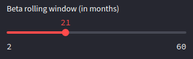

<h1 align="center">Efficient Frontier Calculator</h1>

    
    
    

## **Project Description**

This a financial data science project that allows the user to obtain a efficient frontier graph for a specific portfolio of stocks as well as other portfolio performance indicators using monthly-based price data.

It is a web-hosted interactive application, hosted using [Streamlit's](streamlit.io) Sharing functionality.

The project can be found here: [Link to project](https://share.streamlit.io/tfsm00/markowitz-efficient-frontier/main/efficient-frontier.py)

## **Features**

* Correlation Matrix
* Efficient Frontier
* Alpha and Beta Statistics
* Performance Indicators
    * Compound Annual Growth Rate
    * Annualized Volatility
    * Sharpe Ratio
    * Sortino Ratio
    * Calmar Ratio
    * Max Drawdown
    * Value at Risk
    * Conditional Value at Risk
* Security Market Line
* Rolling Beta

## **Usage**

### Ticker Input
 

This is where the tickers which form the portfolio are inserted. They must be space-separated, that is, a space between each ticker. Also, at least 2 tickers should be inserted.
In the example below, the tickers for `Apple Inc.`, `Microsoft Corp.` and `International Business Machines Corp.` were used.

 

### Date Input
 

This is where a start and end date are to be selected. Obviously, the **start date must be earlier than the end date**. For a result with better accuracy, **the time period should be of, at least, 1 year**.

 

    

 

If one of the **date input boxes** is clicked (image above), a **calendar widget** will appear (image below), making it easier to select a date.

 

    

 

### Rolling Window Slider
 

This a slider widget, where a month window is selected and used by the **rolling beta function**. The slider spans from 2 months to half the selected period of time.

Essentially, if a 6 month window is selected, a beta is calculated from month 1 to 6, from month 2 to 7, and so on until the end of the timeframe.

 

       

 

### "Run Calculations" Button
 

This one is straightforward. After making sure all the other inputs explained before were used correctly, click it and wait a few seconds for the results to appear (a 5 stock and 20 year calculation takes ~15 seconds).

 

    

## **Facts and Assumptions**

* The most important assumption made in this project is that the Standard and Poor's 500 Index is used as market benchmark for all calculations as this project's main target are U.S. Equities.

* The returns are obtained using Yahoo Finance's Price Data and are logarithmic, not arithmetic.

* The risk free rate and market premiums are obtained from E. Fama and K. French's 3 Factor data and the values used are averages from the selected timeframe.

* The efficient frontier is obtained from a Monte Carlo simulation of 5000 runs with random portfolio weights.

* The alpha and beta statistics are obtained through a linear regression between the returns of each asset and the market.

## **Issues and Suggestions**

If you encounter an error in the program, a way to make code faster, any wrong application of financial formulas and concepts or just want to make a suggestion on how to make this project better raise a new issue [here](https://github.com/TFSM00/Efficient-Frontier-Calculator/issues/new/choose). 

## 📝 **Licence**

Copyright © 2019 [Tiago Moreira](https://github.com/TFSM00). 
This project is [MIT](https://github.com/TFSM00/Efficient-Frontier-Calculator/blob/main/LICENSE.txt) licensed.

